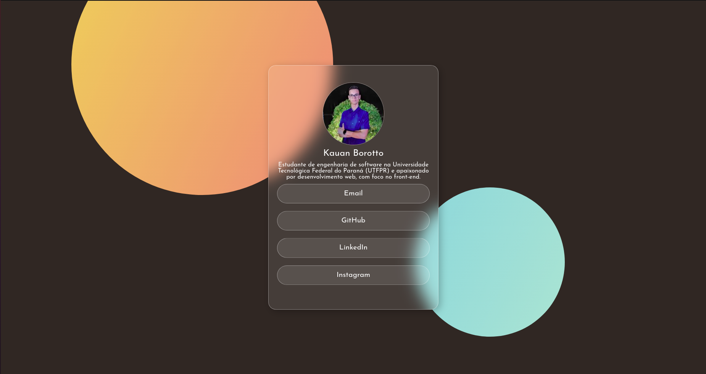

# 📋 Projeto Árvore de links

## 💎 Introdução

 Este projeto tem como objetivo facilitar a organização de links, integrando-os a uma única página intuitiva. Dessa forma, a página que você verá a seguir apresenta os direcionamentos para as redes sociais do autor.

## 💻 Layout Web

## 📱 Layout Mobile

## 🎥 Animação

# ✅ Tecnologias
* HTML 5
* CSS 3

# 📝 Autor
https://www.linkedin.com/in/kauan-borotto-7904401a3/